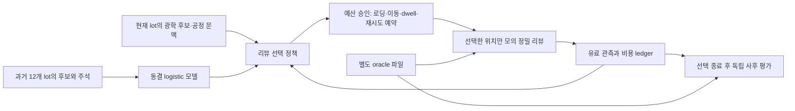

# 검사 선택 연구 실행 안내

전체 설계는 [INSPECTION_PROTOCOL.md](INSPECTION_PROTOCOL.md), 현장 근거는 [INSPECTION_RESEARCH.md](INSPECTION_RESEARCH.md), 기계가 읽는 조건은 `inspection_review/protocol.json`에 있다. 기존 PVT 연구·공개 웨이퍼 데모와 별도 namespace 및 출력 폴더를 사용한다.

## 데이터와 관측



`public.npz`에는 초기 관측, `oracle.npz`에는 생성 정답과 위치별 잠재 센서 결과가 들어간다. `metadata.json`은 lot·split·scenario·seed와 파일 해시다. 훈련 전용 loader는 과거 주석과 split 메타데이터를 읽고, 정책용 loader는 seed/scenario를 전달하지 않는다. 정책의 ID는 평문 scenario를 포함하지 않는다. 이 경계는 재현 가능한 프로그램 인터페이스이며 adversarial 코드에 대한 암호학적 보안 경계는 아니다.

센서 양성과 진양성 확인 수는 다르다. oracle를 읽는 사후 평가만 진양성·오탐을 계산한다. 신규 DOI 위치를 만난 것과 관측에서 신규 유형으로 식별한 것도 별도다. 후보 밖 위치에는 초기 분류기의 유효한 판정이 없으므로 후보 밖 발견을 분류기 false negative 감사 성과에 더하지 않는다.

## 실행

저장소 루트에서 Python 3.12 및 잠긴 numpy 의존성 환경을 사용한다. PowerShell 예시의 `<새 출력 폴더>`는 아직 준비하거나 실행한 적 없는 경로로 바꾼다.

```powershell
& '.\.venv\Scripts\python.exe' -m inspection_review.cli prepare --root '<새 출력 폴더>'
& '.\.venv\Scripts\python.exe' -m inspection_review.cli reproduce --root '<새 출력 폴더>' --lots 1 --budgets 120
& '.\.venv\Scripts\python.exe' -m inspection_review.cli campaign --root '<새 출력 폴더>'
& '.\.venv\Scripts\python.exe' -m inspection_review.cli report --root '<새 출력 폴더>'
```

`prepare`는 훈련 12·검증 4 lot를 저장하고 모델을 학습해 소스·설정·모델·데이터 해시를 동결한다. `reproduce`는 저장된 검증 lot만 사용하는 개발 확인이며 테스트 성과가 아니다. `campaign`은 동결 검증 후 처음으로 테스트 60 lot를 생성하고 8정책 × 2행동범위 × 3독립예산을 실행한다. 실행이 끝난 뒤 `report`는 저장된 증거에서만 보고서를 만든다. 해시가 달라지면 거절하고, 완결·부분 실행을 조용히 재개하거나 덮어쓰지 않는다.

무효화된 준비·실행은 원본 폴더를 보존하고 이유와 수정 commit을 기록한다. 테스트 결과를 확인한 뒤 파라미터를 개선하려면 새로운 연구 버전·학습/검증·아직 사용하지 않은 테스트 lot를 별도로 설계한다.

## 결과를 읽는 순서

1. `freeze.json`: 어떤 소스·환경·모델·seed를 동결했는지.
2. `model_validation.json`: 후보 분류의 precision/recall/Brier. 전체 웨이퍼 탐지 정확도가 아니다.
3. `campaign/report.json`과 `report.md`: 같은 장비 비용의 확인 DOI 수, 대응 lot 비교와 신뢰구간, 조건별·예산별 정책 결과, 후보 포착 상한.
4. `campaign/ledgers/`: 선택 근거, 이전 유료 증거, 초기·갱신 확률, 관측 시도, 실제 소비와 실패/누락 비용.
5. `dataset_manifest.json` 및 `campaign/test_manifest.json`: 분리된 public/oracle 데이터와 해시.

분류 오답률·센서 놓침·선택 정책의 발견량을 각각 본다. 후기 5개 DOI 비용 비교는 두 정책이 목표에 도달한 공통 lot에 한정되고 각각의 도달률도 함께 보고한다. 합성 비용 단위를 실제 초·원·장비 처리량으로 환산하지 않는다. 전기 영향 필드는 모의 잠재 영향이며 전기 검사나 수율 개선의 실증이 아니다.

프로그램 경계 검증은 아래 네 모듈을 실행한다. 실제 저장·훈련·개발 재현 경로를 다루는 추가 통합 검증은 `tests.test_inspection_prepare_integration`에 있다.

```powershell
& '.\.venv\Scripts\python.exe' -m unittest tests.test_inspection_data tests.test_inspection_harness tests.test_inspection_acceptance tests.test_inspection_scheduler_acceptance tests.test_inspection_prepare_integration
```

현장 적용 전 필요한 자료는 같은 lot/층의 광학 후보 특징, 위치를 연결할 수 있는 리뷰 관측, 독립 감사 정답, 실제 비용과 레시피 변경 이력이다. 그 자료가 확보되면 생성 가정을 보정하고 외부 lot로 다시 평가한다. 현재 구현은 합성 연구의 유효성과 누출 방지부터 검증하는 단계다.
