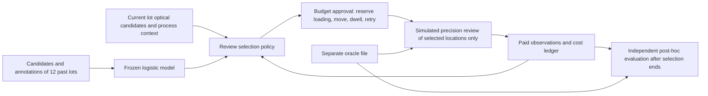

# Inspection Selection Study: Run Guide

The full design is in [INSPECTION_PROTOCOL.md](INSPECTION_PROTOCOL.md) (frozen Korean original; English translation: [INSPECTION_PROTOCOL.en.md](INSPECTION_PROTOCOL.en.md)), the field evidence is in [INSPECTION_RESEARCH.md](INSPECTION_RESEARCH.md), and the machine-readable conditions are in `inspection_review/protocol.json`. It uses a namespace and output folders separate from the existing PVT study and the public wafer demo.

## Data and observation



`public.npz` holds the initial observations, and `oracle.npz` holds the generated ground truth and the latent per-location sensor results. `metadata.json` holds the lot, split, scenario, seed and file hashes. The training-only loader reads past annotations and split metadata; the policy loader does not pass seed/scenario. Policy IDs do not include the plaintext scenario. This boundary is a reproducible program interface, not a cryptographic security boundary against adversarial code.

Sensor positives and true-positive confirmation counts are different. Only the post-hoc evaluation that reads the oracle computes true positives and false positives. Encountering a new-DOI location and identifying it as a new type from observation are also separate. Out-of-candidate locations have no valid judgment from the initial classifier, so out-of-candidate discoveries are not added to the classifier false-negative audit result.

## Running

Use Python 3.12 and an environment with the locked numpy dependency from the repository root. Replace `<new output folder>` in the PowerShell examples with a path that has never been prepared or run.

```powershell
& '.\.venv\Scripts\python.exe' -m inspection_review.cli prepare --root '<new output folder>'
& '.\.venv\Scripts\python.exe' -m inspection_review.cli reproduce --root '<new output folder>' --lots 1 --budgets 120
& '.\.venv\Scripts\python.exe' -m inspection_review.cli campaign --root '<new output folder>'
& '.\.venv\Scripts\python.exe' -m inspection_review.cli report --root '<new output folder>'
```

`prepare` stores the 12 training and 4 validation lots, trains the model and freezes the source, configuration, model and data hashes. `reproduce` is a development check that uses only the stored validation lots and is not test performance. `campaign` generates the 60 test lots for the first time after frozen verification and runs 8 policies × 2 action scopes × 3 independent budgets. After the run ends, `report` builds the report only from stored evidence. If a hash differs it refuses, and it never silently resumes or overwrites a complete or partial run.

Invalidated preparations and runs keep their original folders and record the reason and the fix commit. To improve parameters after seeing the test results, design a new study version, new training/validation and not-yet-used test lots separately.

## Order for reading results

1. `freeze.json`: which source, environment, model and seeds were frozen.
2. `model_validation.json`: precision/recall/Brier of candidate classification. Not whole-wafer detection accuracy.
3. `campaign/report.json` and `report.md`: number of confirmed DOIs at the same tool cost, paired lot comparisons and confidence intervals, per-condition and per-budget policy results, the candidate capture ceiling.
4. `campaign/ledgers/`: selection rationale, prior paid evidence, initial and updated probabilities, observation attempts, actual consumption and failure/dropout costs.
5. `dataset_manifest.json` and `campaign/test_manifest.json`: the separated public/oracle data and hashes.

Look separately at the classification error rate, sensor misses and the discovery yield of the selection policy. The cost-to-5-DOIs comparison is restricted to the common lots where both policies reached the goal, and each policy's reach rate is reported alongside. Synthetic cost units are not converted into real seconds, won or tool throughput. The electrical impact field is a simulated latent impact, not a demonstration of electrical testing or yield improvement.

Program-boundary verification runs the four modules below. An additional integration check covering the real storage, training and development-reproduction path is in `tests.test_inspection_prepare_integration`.

```powershell
& '.\.venv\Scripts\python.exe' -m unittest tests.test_inspection_data tests.test_inspection_harness tests.test_inspection_acceptance tests.test_inspection_scheduler_acceptance tests.test_inspection_prepare_integration
```

The data needed before field application are optical candidate features for the same lot/layer, review observations that can be linked to locations, independent audit ground truth, and actual costs and recipe change history. Once those data are available, the generation assumptions are calibrated and re-evaluated on external lots. The current implementation is at the stage of first verifying the validity and leakage prevention of the synthetic study.
