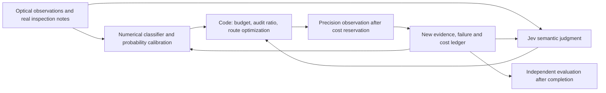

# Wafer Inspection Performance Improvement Candidates and Jev Applicability Survey

2026-10-04. Starting from the results of the current implementation, **40 improvement methods and 30 public repositories** were surveyed. The HEAD, README and LICENSE of each repository were obtained, and they were classified into 26 code reuse candidates, 3 with unverified licenses and 1 reference candidate with restrictions on distributing modified versions. Data, weight and service terms of use are treated separately from code licenses. The verified commits, links to the original license texts and capture hashes are in [source-catalog.json](evidence/inspection-improvements-20261004/source-catalog.json).

This document organizes candidates for follow-up development. The existing research protocol, model, campaign results and public UI were not modified. No item has yet had an actual performance improvement measured, and only a small Jev API integration check was run separately. The scope is not cloning precision inspection tools themselves with public code, but bringing in and applying code for image processing, training, inspection selection, judgment and evaluation.

## What to do first

Compare **nonlinear model + probability calibration + adaptive audit budget + move-cost optimization** first. For the real image path, prioritize three baselines: **registration → high-resolution tiles → PatchCore / AnomalyDINO / EfficientAD**. Jev adds semantic judgment where real inspection notes are available.

| Order | Task | What is needed | Why it comes first | Pass criteria |
| --- | --- | --- | --- | --- |
| 1 | CatBoost versus logistic, and LightGBM if needed | Current public observations and past lot annotations, CPU | Nonlinear interactions in the current numerical features can be tested | DOI improvement at the same observations and CU, with nuisance/rare-type performance reported together |
| 2 | Lot-separated probability calibration and abstention | Independent calibration lots | Checks overconfident normal judgments and the probability reliability of inspection selection | Brier and risk-coverage improvement, reported together with cost increase |
| 3 | Audit budget ratio, keeping random audits | Current paid review harness | Directly addresses the fixed 20% audit reducing total discoveries | Pareto comparison of DOI and high-confidence misses at the same budget |
| 4 | ROI batch, wafer loading and move optimization | Current location and cost contract | Looks for room in the inspection order to confirm more important candidates | 0 cost-reservation violations, reduced move cost, check whether discoveries increase |
| 5 | Out-of-candidate care-area reinspection | A separate paid observation action | Defects not in the optical candidates cannot be recovered by reordering candidates | Out-of-candidate DOI/CU, the same observation opportunity for all policies |
| 6 | Jev shadow routing | Inspection notes with real observation times and expert routing annotations | Uses semantic judgments such as charging, nuisance and insufficient evidence | Routing errors, abstention rate, latency, cost, incremental effect over the numbers-only baseline |
| Right after images are obtained | Registration and tiling, then three anomaly baselines | Native-scale real optical/SEM ROIs | Comparison can start with normal references even with few labels | Lot separation, recall by size and type, performance at fixed FP, real tool latency |

Initial experiment setup time is estimated at about 1–3 hours for each numerical path, 2–4 hours for integrated budget allocation and routing, and 1–2 hours for the Jev shadow interface. These are estimates for implementation planning and do not include time for obtaining images, expert annotation or resolving Windows package issues. Rather than installing every candidate at once, a small first CPU baseline is built and effort is focused on the axes that prove effective.

## Improvement points revealed by current results

In the primary condition of the [existing results](INSPECTION_RESULTS.md), 360 CU candidate-only, learned found 27.77 DOIs per lot and Falsify 23.67. With a difference of −4.10 and a lot-level 95% CI of [−4.65, −3.55], the current Falsify is behind on total discoveries. An improvement therefore cannot be claimed just because a new model or Jev was attached.

The ablation with the fixed audit turned off reached 27.55, close to learned, so audit budget allocation is the axis to experiment on first. The ablation without the spatial term was also better than the current Falsify on the cost of first discovering a new type. This is a diagnosis that the spatial weight may not always be effective, not proof of causal superiority under all conditions. It will be re-evaluated on new validation lots.

The optical candidate capture ceiling in the low-contrast scenario is about 33.2%. This is a consequence of the authored sensor generation conditions, not a real tool specification. Obtaining out-of-candidate signals requires a paid reinspection or another sensor path. Physical sensor improvement, classification improvement and inspection selection improvement are measured as separate axes.

The current data are numerical features and simulated precision review results. There are no SEM pixels, real free-text engineer notes or measured tool logs in seconds. The wafer map figures are not real SEM images and must not be called training data for image AI. Passing the oracle's defect type to Jev rephrased as sentences is also not allowed.

## Key ideas to take from public methodologies

**Normal-reference-based image anomaly detection.** [PatchCore](https://github.com/amazon-science/patchcore-inspection) keeps normal patch features in a memory bank and computes the distance to new images. [AnomalyDINO](https://github.com/OJ2001/AnomalyDino) is a few-shot candidate using DINOv2 patch features and also describes a CPU FAISS path. Within [Anomalib](https://github.com/open-edge-platform/anomalib), PaDiM, EfficientAD, FastFlow, STFPM, Reverse Distillation, DRAEM, WinCLIP and Dinomaly can be compared on the same data format. Adopting one framework first reduces differences in input and evaluation across repositories.

EfficientAD is a speed candidate that combines teacher/student discrepancy with an autoencoder. The GPU latency in the [original paper](https://arxiv.org/abs/2303.14535) does not indicate our Windows, CPU or SEM ROI processing latency. The obtained Anomalib README states that it is based on a separate implementation, so it is not labeled as the paper authors' official code. End-to-end latency including native-scale tiling, registration, decoding and network transfer is measured separately.

**Learning from few labels on real SEM.** The [IBM Albany study](https://arxiv.org/abs/2506.03345) investigated DINOv2 transfer and semi-supervised learning on over 7,400 real SEM images of 300mm wafers across 11 types. The paper reports over 90% classification accuracy with fewer than 15 labels per type, but that figure cannot be used as our model's performance. Our order of application is a frozen encoder + small head, normal-reference comparison, and limited fine-tuning when enough real data are available. The availability of that fab's data and of public code for reproduction was not confirmed this time.

**Active learning aimed at rare defects.** The [semiconductor XRM/HBM study](https://arxiv.org/abs/2507.17359) proposes unlabeled contrastive pretraining and rareness-aware acquisition to handle domain shift and class imbalance. It is not to be confused with the same sensor as SEM. The arXiv upload is from 2025, and the page states acceptance at ICIP 2022. No claim is made that its public implementation or data were obtained; the idea is kept as a candidate to reimplement on top of [modAL](https://github.com/modal-python/modAL) and [BAAL](https://github.com/baal-org/baal). To avoid repeatedly selecting nuisance that merely has high uncertainty, cost, type diversity and the downstream learning effect are compared together.

**Linking measurement actions and selection actions.** Optical screening → SEM review is the field flow described in the [Applied SEMVision H20 material](https://ir.appliedmaterials.com/news-releases/news-release-details/applied-materials-accelerates-chip-defect-review-next-gen-ebeam/), and [ASML eScan](https://www.asml.com/en/products/metrology-and-inspection-systems/hmi-escan-1100) provides an e-beam and voltage-contrast path. The current experiment keeps the same sensor probabilities and compares who chooses which location and path. Once real evidence is obtained, morphology, buried/electrical failure, acquisition artefact and CD/overlay will be separated into different actions. Product throughput improvements are not turned into our AI improvement rate.

## Jev: verified scope and application design

The [current official model](https://docs.typesafe.ai/models) is `jev-1.13.0`. It accepts text input only and does not offer image/video input or per-account fine-tuning/LoRA. Domain rules are specified with state, instructions and criteria, and downstream models are trained separately. Input pricing is $0.042 per 1 million tokens, and output is free. English is the main training language, and Korean operation would need a separate evaluation.

In the [API](https://docs.typesafe.ai/api), Choice returns a choice and a probability distribution, Noul returns a yes probability, and Score returns probabilities over defined levels. Choice confidence is distribution concentration, not an actual accuracy rate. The official [failure characteristics](https://docs.typesafe.ai/model-jaggedness/jev-1.13) explain that the accuracy of numbers, dates and counts and the context/option composition can have an effect. Cost, threshold comparison, distance, dose and precise numerical computation are done in code.

### Real call check

A small check was run at 2026-10-04 06:05 UTC with a key registered in an environment variable. The key was neither logged nor committed. The [raw responses](evidence/inspection-improvements-20261004/jev-smoke/calls.jsonl), [summary](evidence/inspection-improvements-20261004/jev-smoke/summary.json) and [reusable script](scripts/probe_jev_semantics.py) are preserved.

| Item | Measured value | Interpretation |
| --- | --- | --- |
| Model | jev-1.13.0 | Response model ID confirmed |
| Input | 10 English inspection notes written by hand | Not real fab data |
| Requests | Each called with original and reversed options, 20 calls total | Not 20 independent inspection samples |
| Questions | Choice routing + Noul acquisition-invalid | Two atomic judgments in one request |
| Normal responses and schema validation | 20/20 | Integration smoke success |
| Agreement with the authored routing rubric | 20/20 | Does not mean 100% semiconductor accuracy |
| Routing agreement across option orders | 10/10 pairs | Order stability on this small example |
| Median latency of successful requests | 219.15ms | Sequential HTTPS, measured without a connection pool |
| Sample p95 of successful requests | 457.12ms | Nearest-rank statistic on a small sample; not an SLA |
| Input/output tokens | 11,218 / 1,748 | Real API usage |
| Estimate based on input price | $0.000471156 | Not a billing receipt |

This result does not prove real defect classification accuracy, probability calibration or improvement over existing LLMs. The confidence and Noul results were recorded but not used for automatic tool control. Repeat checks specify a new output directory. Running without `--run` prints only the request plan, and execution is limited to at most 20 calls with no retries.

### Judgments to attach to the real harness

1. `acquisition_invalid`: does the real observation note contain invalid signals such as charging or blur?
2. `evidence_sufficient`: is the stated evidence sufficient for choosing the next path?
3. `review_modality`: which path applies: morphology review, electrical/buried defect confirmation, re-imaging, no further inspection needed, or insufficient evidence?
4. `unexpected_morphology`: compared with previously confirmed types, does it need review as a new pattern?

Each judgment is defined as an independent rubric, and the needed references are provided directly in the state. They can be bundled into one request with the [fan-out pattern](https://docs.typesafe.ai/patterns/fan-out), but the questions cannot see each other's answers. Code combines the results and decides which branch to apply. Hidden defect ground truth or descriptions of not-yet-observed images are not put into the state.

The event time, observation source and label creation time of real notes are recorded. Descriptions obtained after SEM review can be used only after that cost has been paid. Real SEM results are not included in the initial notes in advance. Descriptions made by an image encoder or by experts also carry the errors and latency of a separate stage.

Jev is not started with individual calls over the whole wafer. It is called only on notes whose meaning changed and on the current shortlist, and cached by `model + rubric hash + relevant state hash`. When different notes are bundled into the same state, whether the question points to the correct record is evaluated separately. Network, errors and fallback are included in total latency, and results are reported together with the fallback's simple numerical policy.

### Jev feature learning and local distillation

The [TypeSafe AutoResearch example](https://docs.typesafe.ai/cookbooks/autoresearch_feature_discovery) shows feeding Jev semantic features into CatBoost and improving questions with dev OOF residuals. It is a wine text example and is not evidence of a semiconductor improvement rate. In our application, probability features from genuine notes are added to the numerical baseline, and questions and features are selected only on dev lots. After freezing the questions and model, they are applied once to new held-out lots.

To reduce repeated API cost and latency, reviewed Jev judgments can be distilled into a small local text model. This is not training the Jev server model with a personal LoRA. To avoid learning the teacher's errors as is, an expert gold set and separate validation for new types are kept. For calibration, risk-coverage and shadow runs, code reuse from [judge-audit](https://github.com/kunko-ai-labs/judge-audit), [typed_evals](https://github.com/TrustifAI/typed_evals) and [jevals](https://github.com/openlayer-ai/jevals) is compared. Those repositories' accuracy and latency in other domains are not cited as our results.

## Designs that actually improve training and evaluation

**The data unit is the lot.** Adjacent ROIs of the same wafer, or augmentations generated from the same original, are not placed on both the train and test sides. Time, tool, layer and recipe are recorded, and new product / tool change / low contrast / rare type conditions are reported separately. Synthetic data are used for initial implementation checks and controlled hypothesis experiments, and performance is measured separately on real held-out images.

**Decide the optimization metric first.** A production mode that maximizes total DOI/CU and an audit mode that finds high-confidence misses and new types have different value. Keeping the original primary 20% improvement goal requires verifying that goal at the same budget. A separate experiment that prioritizes audit performance freezes a new primary in advance. Switching after the fact to a favorable metric and calling it a win is not done.

**Prepare new development and test sets.** The 60 v1 test lots already read are kept for regression checks and are not used to select models, ratios or thresholds. In v2, distinct new train/calibration/development/test lots are generated or obtained. Development folds use per-lot cross-validation, calibration lots are separate, and test lots use new seeds and a new output path. Generator changes are recorded as separate scenario extensions with physical justification, and existing unfavorable conditions are not deleted.

**Limit the axes changed at once.** Ablate in order: ① logistic→boosting, ② raw→calibrated, ③ fixed→adaptive audit, ④ greedy→route-aware, ⑤ numeric→numeric+genuine Jev semantics. All policies share the candidates, sensors, retries, observable times and budget contract. Model training uses only past annotations, and online updates happen only after paid observations.

**Keep inconvenient baselines.** learned, uncertainty/diversity, the existing Falsify, no-audit, no-spatial and random are kept. The new boosting-based learned is given the same observation information to evaluate the incremental effect of semantic judgment. The candidate-only and rescan comparisons are each presented in separate tables. Final evaluation reports per-lot paired CIs, total DOI, high-confidence misses, cost of first discovering a new type, PR-AUC/recall/Brier, and p50/p95, failures and price together.

**Handle selection bias.** Some random audits with known probabilities are kept to ground an estimate of total misses. Contextual bandit/off-policy experiments need new logs that record actual selection propensity and support. Attaching arbitrary propensities to the current deterministic v1 ledger and calling it unbiased IPS/DR evaluation is not done.

## Data candidates and reuse boundaries

| Candidate | Usable experiments | Scope checked this time |
| --- | --- | --- |
| Current synthetic 3-wafer/lot harness | Numerical classification, inspection selection, budget and leakage verification | Reproducible; not real SEM performance |
| [VisA](https://github.com/amazon-science/spot-diff) | Checking the image anomaly pipeline, tiling and performance tools | README: data CC BY 4.0, code Apache-2.0. Includes PCB etc.; not wafer SEM |
| [MVTec AD](https://www.mvtec.com/company/research/datasets/mvtec-ad) | Reproducing normal-reference anomaly methods | [AnomalyDINO README](https://github.com/OJ2001/AnomalyDino) states CC BY-NC-SA 4.0; check the terms for each use before using |
| IBM Albany SEM study data | The most direct few-label ADC validation | The real SEM paper was checked; obtaining usable public data/code is not done |
| XRM HBM study data | Learning buried structures and rare segmentation | The paper was checked; obtaining public data/code is not done |
| WM-811K / mixed wafer maps | Spatial bin-map pattern research | A different task from real fine defect images; not included in this round's approved code-reuse list |

BrightData can be a route to fetching accessible web data, but it does not newly create the public availability, precision images, terms of use or label truthfulness of the original data. No paid data purchase or external submission was made in this survey.

**The code/weights of the general DINOv2 models are Apache-2.0**, but the XRay-DINO weights in the same repository are separately marked with the FAIR Noncommercial Research License. The terms of each image model's teacher/backbone and training data are recorded separately. [That README](https://github.com/facebookresearch/dinov2)

Although WaferSegClassNet has public code, the LICENSE obtained this time is **CC BY-NC-ND 4.0**. It is excluded from the priority fork candidates premised on distributing modified code. For AnthusAI/Jev-Calibration, NicolasMontone/jev-evals and JordanAsh/badge, the LICENSE could not be verified in this survey, so the mere fact that they are readable did not lead to classifying them as reusable code.

## The 40 methods surveyed

P0 are candidates to verify first, P1 are follow-up candidates after the foundation or data are secured, and P2 are for comparison or long-term candidates. `P0_images` and `P0_notes` can start only once the corresponding real data are obtained. Specific caveats and the original sources of each method are in [method-catalog.json](evidence/inspection-improvements-20261004/method-catalog.json).

| ID | Method | Data needed before application | Priority | Intervention and verification |
| --- | --- | --- | --- | --- |
| M01 | Expanded observation features | Current numerical harness | P0 | Use interactions of observed signals, process layer, radius and tool context; exclude oracle type/seed/scenario. Verification: per-lot PR-AUC, Brier, DOI/CU |
| M02 | CatBoost / LightGBM / XGBoost | Current numerical harness | P0 | Compare the 7-feature logistic with nonlinear boosting on the same lot folds and the same observations. Verification: DOI at the same cost, candidate recall, nuisance precision |
| M03 | Training that reflects rare defects and cost | Current numerical harness | P0 | Imbalance weights and per-risk thresholds; applied within training folds. Verification: per-type recall, review precision, cost |
| M04 | Probability calibration and abstention | Current numerical harness | P0 | sigmoid/isotonic calibration on lot-separated OOF probabilities; abstention threshold chosen on validation. Verification: Brier/ECE, risk-coverage, high-confidence misses |
| M05 | Ensemble disagreement / OOD | Current numerical harness | P1 | Build audit candidates from independent lot-bootstrap models and observed-feature OOD. Verification: cost of first discovery of a new type, high-confidence misses |
| M06 | Adaptive audit budget allocation | Current numerical harness | P0 | Instead of the existing fixed 20%, a bounded allocation driven by validated selection rates/audit rewards, with Pareto comparison. Verification: per-cost curves of total DOI and miss counterexamples |
| M07 | Loading, move and batch cost optimization | Current numerical harness | P0 | Using the existing CU contract instead of measurements, compare greedy ratio with bounded lookahead/OR-Tools routing. Verification: DOI/CU, breakdown of loading, move and dwell |
| M08 | Contextual bandit | Additional order/selection-probability logs | P1 | Choose the next review action from observed context and past paid rewards, and record propensity. Verification: online discovery curve, regret diagnostics |
| M09 | Core-set / spatial and pattern diversity | Current numerical harness | P1 | Reduce duplication among similar candidates and compare diversity in observed-feature space and wafer location together. Verification: duplicate review rate, new DOIs and learning efficiency |
| M10 | BALD / Bayesian active learning | posterior/ensemble | P1 | Normalize the information gain of the MC dropout/ensemble posterior by review cost. Verification: labels/CU to reach target recall |
| M11 | Drift detection such as ADWIN | Additional order/selection-probability logs | P1 | Monitor time-ordered observation errors/signals and evaluate triggers for recalibration and stronger auditing. Verification: detection delay, false alarms, misses |
| M12 | Conformal prediction / risk control | Current numerical harness | P1 | Build decision sets and abstention with lot-separated calibration. Verification: abstention rate, empirical coverage, cost |
| M13 | Die-to-die image registration and reference comparison | Real optical/SEM images | P0_images | After phase correlation/ECC registration, use residuals and structural differences as defect candidates. Verification: nuisance precision, recall by size |
| M14 | High-resolution tiles and multi-scale | Real optical/SEM images | P0_images | Tile the whole wafer map and separate SEM ROIs at native pixel scale and merge overlaps. Verification: recall by minimum defect size, RAM/latency |
| M15 | PatchCore | Real optical/SEM images | P0_images | Memory bank of normal patch embeddings and coreset nearest-neighbor distance. Verification: PR-AUC by type/size, recall at fixed FP |
| M16 | PaDiM | Real optical/SEM images | P1 | Score anomalous regions against per-patch Gaussian/Mahalanobis distributions of normal data. Verification: recall at fixed FP, training/memory |
| M17 | EfficientAD | Real optical/SEM images | P0_images | Fast segmentation after normal training using teacher-student and autoencoder discrepancy. Verification: end-to-end latency and recall on our tool |
| M18 | FastFlow | Real optical/SEM images | P1 | Estimate normal visual feature likelihood with a 2D normalizing flow. Verification: per-type recall, training/inference latency |
| M19 | STFPM / Reverse Distillation | Real optical/SEM images | P1 | Learn multi-layer feature reconstruction of normal images and localize teacher/student differences. Verification: small-defect recall, performance at fixed FP |
| M20 | AnomalyDINO | Real optical/SEM images | P0_images | Few-shot anomaly detection with frozen DINOv2 patch embeddings and a few normal references. Verification: performance and inference cost by number of normal references |
| M21 | Dinomaly | Real optical/SEM images | P2 | Keep DINOv2 feature-reconstruction-based anomaly detection as a comparison candidate. Verification: precision-recall on the same data/budget |
| M22 | WinCLIP | Real optical/SEM images | P2 | Zero/few-shot comparison with normal/anomaly language prompts and image embeddings. Verification: new-type recall and prompt sensitivity |
| M23 | SEM self-supervised pretraining | Real optical/SEM images | P0_images | Representation learning on unlabeled real SEM, then training a few-label head. Verification: classification performance by label count, per-type recall |
| M24 | Frozen encoder + head / limited LoRA | Real optical/SEM images | P1 | Start by training a small classifier and compare fine-tuning some layers/adapters when data are sufficient. Verification: training time and memory, generalization to new lots |
| M25 | Rare-class-first active learning | Real optical/SEM images | P1 | Acquire annotations by combining uncertainty with rare classes, process variation and cost. Verification: rare-type recall / annotation budget |
| M26 | DRAEM / morphology-constrained synthetic augmentation | Real optical/SEM images | P1 | Defect augmentation on normal images; distinguish the realism of bridge/open/particle morphology, dose and blur. Verification: real held-out performance and the synthetic-to-real gap |
| M27 | Cleanlab / label error review | Real annotations | P1 | Find candidate label problems with OOF predictions and have experts recheck them. Verification: recheck cost, label agreement, recall |
| M28 | Pseudo-label / consistency / distillation | Real optical/SEM images | P2 | Use unlabeled data with a validated teacher and augmentation consistency. Verification: recall and bias at fixed paid labels |
| M29 | Fusion of optical, SEM, voltage-contrast and electrical evidence | Additional sensor observations | P1 | Link visible morphology, buried/electrical failure and nuisance through separate sensor observations. Verification: per-sensor/integrated misses and acquisition cost |
| M30 | CD/overlay metrology path selection | Additional sensor observations | P2 | For suspected dimensional error, choose a suitable metrology action instead of morphology classification. Verification: dimensional error, measurement cost, DOI linkage |
| M31 | Re-imaging, dose and dwell adaptation | Additional sensor observations | P1 | Repeat invalid images and add precision acquisition only for uncertain evidence. Verification: information/DOI per additional observation, damage and cost |
| M32 | Out-of-candidate care-area audit | Current numerical harness | P0 | Obtain additional paid observations from samples with known probabilities in regions excluded from candidates. Verification: optical candidate ceiling, outside DOI/CU |
| M33 | ONNX Runtime / OpenVINO | Exportable models | P1 | Measure export of supported models, batching and mixed precision/quantization. Verification: end-to-end p50/p95, power/memory and recall |
| M34 | Embedding and Jev cache / batch / coreset | Current numerical harness | P0 | Cache by model+rubric+input hash; batched vector scoring and compression of similar normal references. Verification: cache hits, runtime, equivalent decisions |
| M35 | Jev atomic inspection-note routing | Real inspection notes | P0_notes | Judge image quality, evidence sufficiency and review modality with Choice/Noul in one request. Verification: expert routing labels, p50/p95, risk-coverage |
| M36 | Jev semantic features → CatBoost | Real inspection notes | P1 | Generate semantic-feature probabilities from past real notes and improve questions using dev OOF errors. Verification: incremental DOI/latency over the numeric baseline without notes |
| M37 | Jev judge audit and calibration | Expert judgment annotations | P0_notes | Shadow-run whether selections and explanations meet the evidence, and audit calibration/risk-coverage/option-order. Verification: Brier/ECE, semantic errors, p95, abstention rate |
| M38 | Distilling Jev labels into a small local model | Real inspection notes | P2 | Judge reviewed notes once with Jev, then train a local text model to reduce repeated API calls. Verification: difference from expert ground truth, latency/cost |
| M39 | Expert abstention and labeling specification | Real annotations | P1 | Review uncertain/new cases with the original images and observation order; distinguish functional importance from morphology. Verification: expert agreement, review time, rare recall |
| M40 | Recording propensity, time and data provenance | Additional order/selection-probability logs | P0 | Append-only records of acquisition time, selection probability, model/rubric hash, failures, latency and cost. Verification: reproducibility, 0 leakage/budget violations, OPE identifiability |

## The 30 public repositories checked

Each link is pinned to the checked commit. The license table is a classification of repository code as reuse candidates, not a determination of usability for all data and weights.

| Repository | Verified code license | Judgment |
| --- | --- | --- |
| [open-edge-platform/anomalib](https://github.com/open-edge-platform/anomalib/tree/335a6be1eac101030d3085082883dc4c1b861dce) | [Apache-2.0](https://github.com/open-edge-platform/anomalib/blob/335a6be1eac101030d3085082883dc4c1b861dce/LICENSE) | Code reuse candidate |
| [amazon-science/patchcore-inspection](https://github.com/amazon-science/patchcore-inspection/tree/fcaa92f124fb1ad74a7acf56726decd4b27cbcad) | [Apache-2.0](https://github.com/amazon-science/patchcore-inspection/blob/fcaa92f124fb1ad74a7acf56726decd4b27cbcad/LICENSE) | Code reuse candidate |
| [OJ2001/AnomalyDino](https://github.com/OJ2001/AnomalyDino/tree/829c453005da830606d4aaa366ba3e8d549426a3) | [Apache-2.0](https://github.com/OJ2001/AnomalyDino/blob/829c453005da830606d4aaa366ba3e8d549426a3/LICENSE) | Code reuse candidate |
| [facebookresearch/dinov2](https://github.com/facebookresearch/dinov2/tree/7764ea0f912e53c92e82eb78a2a1631e92725fc8) | [Apache-2.0](https://github.com/facebookresearch/dinov2/blob/7764ea0f912e53c92e82eb78a2a1631e92725fc8/LICENSE) | Code reuse candidate |
| [catboost/catboost](https://github.com/catboost/catboost/tree/3d704cd691490933ad46fdd54764e0728538d711) | [Apache-2.0](https://github.com/catboost/catboost/blob/3d704cd691490933ad46fdd54764e0728538d711/LICENSE) | Code reuse candidate |
| [microsoft/LightGBM](https://github.com/microsoft/LightGBM/tree/439136e5e12e8a97d8fa4583d9e85e1189fba2ba) | [MIT](https://github.com/microsoft/LightGBM/blob/439136e5e12e8a97d8fa4583d9e85e1189fba2ba/LICENSE) | Code reuse candidate |
| [dmlc/xgboost](https://github.com/dmlc/xgboost/tree/b16b82e4b27276e68cdc56c2471b24769b8d2998) | [Apache-2.0](https://github.com/dmlc/xgboost/blob/b16b82e4b27276e68cdc56c2471b24769b8d2998/LICENSE) | Code reuse candidate |
| [scikit-learn/scikit-learn](https://github.com/scikit-learn/scikit-learn/tree/a442e4bb39551feb7b0af4c00075e2cb91cf9b77) | [BSD-3-Clause](https://github.com/scikit-learn/scikit-learn/blob/a442e4bb39551feb7b0af4c00075e2cb91cf9b77/COPYING) | Code reuse candidate |
| [scikit-learn-contrib/MAPIE](https://github.com/scikit-learn-contrib/MAPIE/tree/3b84b8212db2bba452ef5a09ae06a0dd545869ae) | [BSD-3-Clause](https://github.com/scikit-learn-contrib/MAPIE/blob/3b84b8212db2bba452ef5a09ae06a0dd545869ae/LICENSE) | Code reuse candidate |
| [online-ml/river](https://github.com/online-ml/river/tree/086e8028b4867ee7dbc40d4e7b9886c5fe80f4a7) | [BSD-3-Clause](https://github.com/online-ml/river/blob/086e8028b4867ee7dbc40d4e7b9886c5fe80f4a7/LICENSE) | Code reuse candidate |
| [modal-python/modAL](https://github.com/modal-python/modAL/tree/bba6f6fd00dbb862b1e09259b78caf6cffa2e755) | [MIT](https://github.com/modal-python/modAL/blob/bba6f6fd00dbb862b1e09259b78caf6cffa2e755/LICENSE) | Code reuse candidate |
| [baal-org/baal](https://github.com/baal-org/baal/tree/2309c970e2e6200edfdfc1e4e554bd48bc08a751) | [Apache-2.0](https://github.com/baal-org/baal/blob/2309c970e2e6200edfdfc1e4e554bd48bc08a751/LICENSE) | Code reuse candidate |
| [google/or-tools](https://github.com/google/or-tools/tree/100f66e6242ab8bf8d32feb8f3bf086db66ae2b5) | [Apache-2.0](https://github.com/google/or-tools/blob/100f66e6242ab8bf8d32feb8f3bf086db66ae2b5/LICENSE) | Code reuse candidate |
| [VowpalWabbit/vowpal_wabbit](https://github.com/VowpalWabbit/vowpal_wabbit/tree/00196b35f63bcb8a6d66966e2b4cf67d6a2bd335) | [BSD-3-Clause](https://github.com/VowpalWabbit/vowpal_wabbit/blob/00196b35f63bcb8a6d66966e2b4cf67d6a2bd335/LICENSE) | Code reuse candidate |
| [cleanlab/cleanlab](https://github.com/cleanlab/cleanlab/tree/750625747de1b26d8530954f51f0530bd0b51d3c) | [Apache-2.0](https://github.com/cleanlab/cleanlab/blob/750625747de1b26d8530954f51f0530bd0b51d3c/LICENSE) | Code reuse candidate |
| [opencv/opencv](https://github.com/opencv/opencv/tree/20e367198c7adde8f1efc0f525256b1e15798024) | [Apache-2.0](https://github.com/opencv/opencv/blob/20e367198c7adde8f1efc0f525256b1e15798024/LICENSE) | Code reuse candidate |
| [scikit-image/scikit-image](https://github.com/scikit-image/scikit-image/tree/533b7694d2004ae84e49e2cfd0bcfc5f8e562f22) | [BSD-3-Clause + BSD-2-Clause + MIT (file-specific)](https://github.com/scikit-image/scikit-image/blob/533b7694d2004ae84e49e2cfd0bcfc5f8e562f22/LICENSE.txt) | Code reuse candidate |
| [microsoft/onnxruntime](https://github.com/microsoft/onnxruntime/tree/690e73121061595a6fc15f1f4b29afcda1d666dc) | [MIT](https://github.com/microsoft/onnxruntime/blob/690e73121061595a6fc15f1f4b29afcda1d666dc/LICENSE) | Code reuse candidate |
| [openvinotoolkit/openvino](https://github.com/openvinotoolkit/openvino/tree/f766febd1c0ca99444eed6202e47ee5f932048c8) | [Apache-2.0](https://github.com/openvinotoolkit/openvino/blob/f766febd1c0ca99444eed6202e47ee5f932048c8/LICENSE) | Code reuse candidate |
| [huggingface/peft](https://github.com/huggingface/peft/tree/532a05dd505c28993119b7715ee286f4234bf51b) | [Apache-2.0](https://github.com/huggingface/peft/blob/532a05dd505c28993119b7715ee286f4234bf51b/LICENSE) | Code reuse candidate |
| [Siim/jev-claim-vs-measured](https://github.com/Siim/jev-claim-vs-measured/tree/d2682e5abd848f4aae91897b5d3418e7e7d4d26a) | [MIT](https://github.com/Siim/jev-claim-vs-measured/blob/d2682e5abd848f4aae91897b5d3418e7e7d4d26a/LICENSE) | Code reuse candidate |
| [AnthusAI/Jev-Calibration](https://github.com/AnthusAI/Jev-Calibration/tree/9788ecc5526b32da9fa9b9b38964586060677c77) | [not_verified](https://github.com/AnthusAI/Jev-Calibration) | Code reuse on hold until license is verified |
| [kunko-ai-labs/judge-audit](https://github.com/kunko-ai-labs/judge-audit/tree/786b7f91ab82cc47421fc70c4b9dc7c2e15e44a8) | [Apache-2.0](https://github.com/kunko-ai-labs/judge-audit/blob/786b7f91ab82cc47421fc70c4b9dc7c2e15e44a8/LICENSE) | Code reuse candidate |
| [TrustifAI/typed_evals](https://github.com/TrustifAI/typed_evals/tree/ab9fc8a5c3e032ca5732cc0afa318cdd44d331af) | [MIT](https://github.com/TrustifAI/typed_evals/blob/ab9fc8a5c3e032ca5732cc0afa318cdd44d331af/LICENSE) | Code reuse candidate |
| [openlayer-ai/jevals](https://github.com/openlayer-ai/jevals/tree/0a8f895a0428b89c865f953d5295b6b516e4018c) | [MIT](https://github.com/openlayer-ai/jevals/blob/0a8f895a0428b89c865f953d5295b6b516e4018c/LICENSE) | Code reuse candidate |
| [NicolasMontone/jev-evals](https://github.com/NicolasMontone/jev-evals/tree/361d30be8a5264016361d3e6159ab48ac69483ee) | [not_verified](https://github.com/NicolasMontone/jev-evals) | Code reuse on hold until license is verified |
| [amazon-science/spot-diff](https://github.com/amazon-science/spot-diff/tree/2a692ab575001cbde74d402d897a7286086c6199) | [Apache-2.0](https://github.com/amazon-science/spot-diff/blob/2a692ab575001cbde74d402d897a7286086c6199/LICENSE) | Code reuse candidate |
| [ckmvigil/WaferSegClassNet](https://github.com/ckmvigil/WaferSegClassNet/tree/36a47ac96ef11e17ee4e14522b2eb984d9704c7b) | [CC-BY-NC-ND-4.0](https://github.com/ckmvigil/WaferSegClassNet/blob/36a47ac96ef11e17ee4e14522b2eb984d9704c7b/LICENSE.md) | Excluded from fork candidates for distributing modified versions |
| [JordanAsh/badge](https://github.com/JordanAsh/badge/tree/a2d18acd372cf0f61d9e75bfb0c879c107fbf9f6) | [not_verified](https://github.com/JordanAsh/badge) | Code reuse on hold until license is verified |
| [google/active-learning](https://github.com/google/active-learning/tree/efedd8f1c45421ee13af2b9ff593ad31f3835942) | [Apache-2.0](https://github.com/google/active-learning/blob/efedd8f1c45421ee13af2b9ff593ad31f3835942/LICENSE) | Code reuse candidate |

## Outputs and verification

- [Improvement method list](evidence/inspection-improvements-20261004/method-catalog.json): 40 methods, interventions, metrics, applicability conditions and limitations.
- [Source list](evidence/inspection-improvements-20261004/source-catalog.json): 30 repositories, commits, links to the original README/LICENSE texts and SHA-256.
- [Anomalib implementation sources](evidence/inspection-improvements-20261004/anomalib-implementations.json): READMEs of the 8 models read in detail.
- [Jev call evidence](evidence/inspection-improvements-20261004/jev-smoke/summary.json): toy semantic routing integration results. No API key.
- The original READMEs/LICENSEs and the official TypeSafe documentation files are preserved outside the app Git repository in `C:/Users/user/hacknation7th/output/improvement-methods-20261004/`.

Follow-up implementation proceeds in a separate v2 namespace/protocol. The frozen source `e9751106665b0724b1d287ad1c909b1183e3353d` and result commit `217494995e0289b9cc5a624ba94faa416b596475` of the existing 2,880-run campaign were preserved as is. The results of surveying improvement methods this time are distinguished from results that measure improvement effects.
