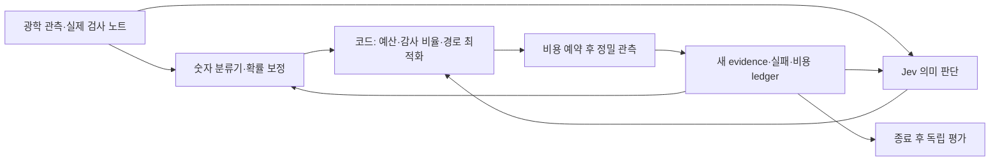

# 웨이퍼 검사 성능 개선 후보와 Jev 적용 조사

2026-10-04. 현재 구현의 결과를 출발점으로 **40개 개선 방법, 공개 저장소 30개**를 조사했다. 각 저장소의 HEAD·README·LICENSE를 확보했으며 코드 재사용 후보 26개, 라이선스 미확인 3개, 수정본 배포 제한이 있는 참고 후보 1개로 분류했다. 데이터·가중치·서비스 이용 조건은 코드 라이선스와 별도로 취급한다. 확인한 커밋·라이선스 원문 링크·캡처 해시는 [source-catalog.json](evidence/inspection-improvements-20261004/source-catalog.json)에 있다.

이 문서는 후속 개발 후보를 정리한 것이다. 기존 연구 프로토콜, 모델, 캠페인 결과, 공개 UI는 수정하지 않았다. 실제 성능 개선이 측정된 항목은 아직 없으며 Jev API의 작은 연동 점검만 별도로 실행했다. 정밀 검사 장비 자체를 공개 코드로 복제하는 것이 아니라, 영상 처리·학습·검사 선택·판단·평가 코드를 가져와 적용하는 범위다.

## 지금 가장 먼저 할 일

**비선형 모델 + 확률 보정 + 적응형 감사 예산 + 이동 비용 최적화**를 먼저 비교한다. 실제 영상 경로는 **정합 → 고해상도 tile → PatchCore / AnomalyDINO / EfficientAD** 세 기준선을 우선한다. Jev는 실제 검사 노트가 확보되는 곳에 의미 판단을 추가한다.

| 순서 | 작업 | 필요한 것 | 우선하는 이유 | 통과 기준 |
| --- | --- | --- | --- | --- |
| 1 | logistic 대비 CatBoost, 필요하면 LightGBM | 현재 공개 관측과 과거 lot 주석, CPU | 현재 숫자 특징에서 비선형 상호작용을 검증할 수 있음 | 같은 관측·CU에서 DOI 개선, nuisance/희귀 유형 성능 동시 보고 |
| 2 | lot 분리 확률 보정·보류 | 독립 calibration lot | 과신한 정상 판정과 검사 선택의 확률 신뢰도 확인 | Brier·risk-coverage 개선, 비용 증가와 함께 보고 |
| 3 | 감사 예산 비율과 무작위 감사 유지 | 현재 유료 리뷰 하네스 | 고정 20% 감사가 총 발견량을 줄이는 현상을 직접 다룸 | 동일 예산에서 DOI와 고확신 미검의 Pareto 비교 |
| 4 | ROI batch·wafer 로딩·이동 최적화 | 현재 위치·비용 계약 | 중요한 후보를 더 많이 확인할 여지를 검사 순서에서 찾음 | 비용 예약 위반 0, 이동 비용 감소, 발견량 증가 여부 확인 |
| 5 | 후보 밖 care-area 재검사 | 별도 유료 관측 행동 | 광학 후보에 들어오지 않은 결함은 후보 재정렬로 복구 불가 | 후보 밖 DOI/CU, 모든 정책에 같은 관측 기회 |
| 6 | Jev shadow routing | 실제 관측 시각이 있는 검사 노트와 전문가 경로 주석 | charging/nuisance/근거 부족 등 의미 판단 활용 | routing 오류·보류율·지연·비용, 숫자-only baseline 대비 증분 효과 |
| 영상 확보 직후 | 정합과 tile 후 세 anomaly 기준선 | native-scale 실제 optical/SEM ROI | 레이블이 적어도 정상 reference로 비교를 시작할 수 있음 | lot 분리, 크기·유형별 recall, 고정 FP 성능, 실제 장비 지연 |

초기 실험 준비 시간은 숫자 경로 각각 약 1–3시간, 통합 예산 배분·routing 2–4시간, Jev shadow 인터페이스 1–2시간으로 예상한다. 이는 구현 계획용 추정이며 영상 확보·전문가 주석·Windows 패키지 문제 해결 시간은 포함하지 않는다. 모든 후보를 동시에 설치하기보다 첫 CPU 기준선을 작게 만든 뒤 유효한 축에 집중한다.

## 현재 결과에서 드러난 개선 지점

[기존 결과](INSPECTION_RESULTS.md)의 primary 조건인 360 CU·candidate-only에서 learned는 lot당 DOI 27.77개, Falsify는 23.67개다. 차이 −4.10개, lot 단위 95% CI [−4.65, −3.55]로 현재 Falsify가 총 발견량에서 열세다. 따라서 새 모델이나 Jev를 붙였다는 이유로 향상을 주장할 수 없다.

고정 감사를 끈 ablation은 27.55개로 learned에 가까워 감사 예산 배분이 우선 실험할 축이다. 공간 항을 제거한 ablation은 신규 유형 첫 발견 비용에서도 현재 Falsify보다 좋았다. 이는 공간 가중치가 항상 유효하지 않을 수 있다는 진단이며, 모든 조건에서의 인과적 우월성을 입증한 것은 아니다. 새 validation lot에서 재평가한다.

low-contrast 시나리오의 광학 후보 포착 상한은 약 33.2%다. 이는 작성한 센서 생성 조건의 결과이며 실제 장비 사양이 아니다. 후보 밖 신호를 얻으려면 유료 재검사 또는 다른 센서 경로가 필요하다. 물리 센서 개선, 분류 개선, 검사 선택 개선을 별도 축으로 측정한다.

현재 데이터는 숫자 특징과 모의 정밀 리뷰 결과다. SEM 픽셀·실제 free-text 엔지니어 노트·실측 초 단위 장비 로그는 없다. wafer map 그림은 실제 SEM 영상이 아니므로 영상 AI 학습 데이터로 부르면 안 된다. Jev에 oracle의 결함 유형을 문장으로 바꾸어 전달하는 방법도 허용하지 않는다.

## 공개 방법론에서 가져올 핵심

**정상 reference 기반 영상 이상 탐지.** [PatchCore](https://github.com/amazon-science/patchcore-inspection)는 정상 patch 특징을 memory bank에 보관해 새 영상과의 거리를 계산한다. [AnomalyDINO](https://github.com/OJ2001/AnomalyDino)는 DINOv2 patch 특징을 이용한 few-shot 후보이고 CPU FAISS 경로도 설명한다. [Anomalib](https://github.com/open-edge-platform/anomalib) 안에서 PaDiM·EfficientAD·FastFlow·STFPM·Reverse Distillation·DRAEM·WinCLIP·Dinomaly까지 동일 데이터 형식으로 비교할 수 있다. 한 프레임워크를 먼저 적용하면 여러 저장소의 입력·평가 차이를 줄일 수 있다.

EfficientAD는 teacher/student 차이와 autoencoder를 결합하는 속도 후보다. [원 논문](https://arxiv.org/abs/2303.14535)의 GPU 지연은 우리 Windows·CPU·SEM ROI 처리 지연을 뜻하지 않는다. 확보한 Anomalib README는 별도 구현을 기반으로 한다고 명시하므로 논문 저자의 공식 코드로 표기하지 않는다. native-scale tile, 정합, decode, 네트워크 전송까지 포함한 end-to-end 지연을 따로 잰다.

**실제 SEM의 적은 레이블 학습.** [IBM Albany 연구](https://arxiv.org/abs/2506.03345)는 300mm wafer의 실제 SEM 영상 7,400개 이상·11개 유형에서 DINOv2 전이 및 반지도 학습을 조사했다. 논문은 유형당 15개 미만 레이블에서 90% 초과 분류 정확도를 보고하지만 그 수치를 우리 모델 성능으로 사용할 수 없다. 우리 적용 순서는 동결 encoder+작은 head, 정상 reference 비교, 충분한 실제 데이터가 있을 때 제한적 미세조정이다. 해당 팹 데이터와 재현용 공개 코드의 이용 가능성은 이번에 확인하지 못했다.

**희귀 결함을 겨냥한 능동학습.** [반도체 XRM/HBM 연구](https://arxiv.org/abs/2507.17359)는 domain shift와 클래스 불균형을 다루기 위해 unlabeled contrastive pretraining과 rareness-aware acquisition을 제안한다. SEM과 같은 센서로 혼동하지 않는다. arXiv 업로드는 2025년이고 페이지는 ICIP 2022 채택을 명시한다. 공개 구현·데이터가 확보됐다고 주장하지 않으며 아이디어를 [modAL](https://github.com/modal-python/modAL)·[BAAL](https://github.com/baal-org/baal) 위에서 재구현할 후보로 둔다. 불확실성만 높은 nuisance를 반복 선택하지 않도록 비용·유형 다양성·후속 학습 효과를 함께 비교한다.

**측정 행동과 선택 행동의 연결.** 광학 선별→SEM 리뷰는 [Applied SEMVision H20 자료](https://ir.appliedmaterials.com/news-releases/news-release-details/applied-materials-accelerates-chip-defect-review-next-gen-ebeam/)에 설명된 현장 흐름이고, [ASML eScan](https://www.asml.com/en/products/metrology-and-inspection-systems/hmi-escan-1100)은 전자빔·전압 대비 경로를 제공한다. 현재 실험에서는 동일한 센서 확률을 유지한 채 누가 어느 위치·경로를 선택하는지 비교한다. 이후 실제 evidence를 확보하면 morphology, buried/electrical failure, acquisition artefact, CD/overlay를 서로 다른 행동으로 분리한다. 제품 처리량 개선을 우리의 AI 개선율로 바꾸지 않는다.

## Jev: 확인한 범위와 적용 설계

[현재 공식 모델](https://docs.typesafe.ai/models)은 `jev-1.13.0`이다. 텍스트만 입력받으며 이미지·영상 입력과 계정별 fine-tuning/LoRA는 제공하지 않는다. 도메인 규칙은 state·instructions·criteria로 지정하고 downstream 모델은 별도로 학습한다. 입력 가격은 $0.042/100만 토큰, 출력은 무료다. English가 주된 학습 언어이며 한국어 운영에는 별도 평가가 필요하다.

[API](https://docs.typesafe.ai/api)의 Choice는 선택과 확률 분포, Noul은 yes 확률, Score는 정의한 단계의 확률을 반환한다. Choice confidence는 분포 집중도이며 실제 정답률이 아니다. 공식 [실패 특성](https://docs.typesafe.ai/model-jaggedness/jev-1.13)은 숫자·날짜·count 정확성과 문맥/옵션 구성이 영향을 줄 수 있음을 설명한다. 비용·threshold 비교·거리·dose·정밀 수치 연산은 코드로 수행한다.

### 실제 호출 점검

환경변수에 등록된 키로 2026-10-04 06:05 UTC에 작은 점검을 실행했다. 키는 기록하거나 커밋하지 않았다. [원본 응답](evidence/inspection-improvements-20261004/jev-smoke/calls.jsonl)과 [요약](evidence/inspection-improvements-20261004/jev-smoke/summary.json), [재사용 스크립트](scripts/probe_jev_semantics.py)를 보존했다.

| 항목 | 측정값 | 해석 |
| --- | --- | --- |
| 모델 | jev-1.13.0 | 응답 model ID 확인 |
| 입력 | 직접 작성한 영어 검사 노트 10개 | 실제 팹 데이터 아님 |
| 요청 | 원래/역순 옵션 각각 호출, 총 20회 | 20개의 독립 검사 샘플 아님 |
| 질문 | Choice routing + Noul acquisition-invalid | 한 요청의 두 원자 판단 |
| 정상 응답·schema 검증 | 20/20 | 연동 smoke 성공 |
| 작성한 routing rubric 일치 | 20/20 | 반도체 정확도 100%라는 뜻 아님 |
| 옵션 순서별 routing 일치 | 10/10 쌍 | 이 작은 예시의 순서 안정성 |
| 성공 요청 중앙 지연 | 219.15ms | 순차 HTTPS, connection pool 없이 측정 |
| 성공 요청 표본 p95 | 457.12ms | 작은 표본의 nearest-rank 통계; SLA 아님 |
| 입력/출력 토큰 | 11,218 / 1,748 | 실제 API usage |
| 입력 가격 기준 추정 | $0.000471156 | 청구 영수증 아님 |

이 결과는 실제 결함 분류 정확도·확률 보정·기존 LLM 대비 향상을 증명하지 않는다. confidence·Noul 결과는 기록했지만 자동 장비 조작에는 사용하지 않았다. 반복 점검은 새 출력 디렉터리를 지정한다. `--run` 없이 실행하면 요청 계획만 출력하며, 실행은 최대 20회·재시도 없음이다.

### 실제 하네스에 붙일 판단

1. `acquisition_invalid`: 실제 관측 노트에 charging/blur 등 invalid 신호가 있는가.
2. `evidence_sufficient`: 명시된 근거가 다음 경로 선택에 충분한가.
3. `review_modality`: morphology 리뷰, 전기/매립 결함 확인, 재촬영, 추가 검사 불필요, 근거 부족 중 어느 경로인가.
4. `unexpected_morphology`: 과거 확인 유형과 비교해 새로운 양상으로 검토할 필요가 있는가.

각 판단은 독립 rubric으로 정의하고 필요한 reference를 state에 직접 제공한다. [fan-out 패턴](https://docs.typesafe.ai/patterns/fan-out)으로 한 요청에 묶을 수 있지만 질문끼리는 서로의 답을 보지 못한다. 코드가 결과를 조합하고 적용할 분기를 결정한다. 숨은 결함 정답이나 아직 관측하지 않은 영상 설명은 state에 넣지 않는다.

실제 노트의 event time·관측 출처·label 생성 시각을 기록한다. SEM 리뷰 뒤 얻은 description은 해당 비용을 지불한 뒤에만 사용할 수 있다. 초기 노트에 진짜 SEM 결과를 미리 포함시키지 않는다. 이미지 encoder나 전문가가 만든 설명도 별도 단계의 오류·지연을 포함한다.

Jev 전체 wafer 개별 호출부터 시작하지 않는다. 의미가 바뀐 노트·현재 shortlist에만 호출하고 `model + rubric hash + relevant state hash`별로 캐시한다. 서로 다른 노트를 같은 state에 넣어 묶는 경우에는 질문이 정확한 record를 가리키는지 따로 평가한다. 네트워크·오류·fallback도 전체 지연에 포함하며, fallback의 단순 숫자 정책과 결과를 함께 보고한다.

### Jev 특징 학습과 로컬 증류

[TypeSafe AutoResearch 예제](https://docs.typesafe.ai/cookbooks/autoresearch_feature_discovery)는 Jev 의미 특징을 CatBoost에 넣고 dev OOF 잔차로 질문을 개선하는 방법을 보여준다. 이는 wine text 예제이며 반도체 개선율의 근거가 아니다. 우리 적용에서는 genuine notes의 확률 특징을 숫자 baseline에 추가하고 dev lot에서만 질문·feature를 선택한다. 질문과 모델을 동결한 뒤 새 held-out lot에 한 번 적용한다.

반복 API 비용·지연을 줄이려면 검토한 Jev 판단을 작은 로컬 text 모델에 증류할 수 있다. Jev 서버 모델을 개인 LoRA로 학습하는 방식은 아니다. teacher 오류를 그대로 배우지 않도록 전문가 gold set과 신규 유형 별도 검증을 둔다. calibration·risk-coverage·shadow 실행은 [judge-audit](https://github.com/kunko-ai-labs/judge-audit), [typed_evals](https://github.com/TrustifAI/typed_evals), [jevals](https://github.com/openlayer-ai/jevals)의 코드 재사용을 비교한다. 이 저장소의 타 도메인 정확도·지연은 우리 결과로 인용하지 않는다.

## 학습·평가를 실제로 개선하는 설계

**데이터 단위는 lot다.** 동일 wafer의 인접 ROI나 같은 원본에서 생성한 증강을 train/test 양쪽에 두지 않는다. 시간·설비·층·recipe를 기록하고 신제품/장비 변경/저대비/희귀 유형 조건을 따로 보고한다. synthetic 데이터는 초기 구현 점검과 제어된 가설 실험에 사용하고 실제 held-out 영상으로 별도 성능을 측정한다.

**최적화 지표를 먼저 정한다.** 총 DOI/CU를 최대화하는 생산 모드와 고확신 미검·신규 유형을 찾는 감사 모드는 가치가 다르다. 원래의 primary 20% 향상 목표를 유지하려면 같은 예산에서 그 목표를 검증해야 한다. 감사 성과를 우선하는 별도 실험은 새로운 primary를 사전에 동결한다. 사후에 유리한 지표로 바꿔 승리라고 부르지 않는다.

**새 development와 test를 준비한다.** 이미 읽은 v1 60개 test lot은 회귀 확인용으로 남기고 모델·비율·threshold 선택에는 쓰지 않는다. v2에서 서로 다른 신규 train/calibration/development/test lot을 생성하거나 확보한다. 개발 fold는 lot별 교차검증, calibration lot은 별도, test lot은 새 seed와 새 출력 경로를 사용한다. 생성기 변경은 물리적 근거가 있는 별도 시나리오 확장으로 기록하며 기존 불리한 조건을 삭제하지 않는다.

**한 번에 바꾸는 축을 제한한다.** ① logistic→boosting, ② raw→calibrated, ③ fixed→adaptive audit, ④ greedy→route-aware, ⑤ numeric→numeric+genuine Jev semantics를 순서대로 ablation한다. 모든 정책은 후보·센서·재시도·관측 가능 시각과 예산 계약을 공유한다. 모델 학습은 과거 주석만 사용하며 온라인 업데이트는 유료 관측 이후에만 일어난다.

**불편한 baseline을 유지한다.** learned, uncertainty/diversity, 기존 Falsify, no-audit, no-spatial, random을 유지한다. 새 boosting 기반 learned에도 똑같은 관측 정보를 주어 의미 판단의 증분 효과를 평가한다. candidate-only와 rescan 비교는 각각 별도 표로 낸다. 최종 평가는 lot별 paired CI, 총 DOI, 고확신 미검, 신규 유형 첫 발견 비용, PR-AUC/recall/Brier, p50/p95·실패·가격을 함께 보고한다.

**선택편향을 다룬다.** 알려진 확률의 무작위 감사를 일부 보존해 전체 미검 추정의 근거를 만든다. contextual bandit/off-policy 실험은 실제 selection propensity와 support를 기록한 새 로그가 필요하다. 현재의 결정론적 v1 ledger에 임의 propensity를 붙여 unbiased IPS/DR 평가라고 부르지 않는다.

## 데이터 후보와 재사용 경계

| 후보 | 쓸 수 있는 실험 | 이번 확인 범위 |
| --- | --- | --- |
| 현재 synthetic 3-wafer/lot 하네스 | 숫자 분류·검사 선택·예산·누출 검증 | 재현 가능, 실제 SEM 성능 아님 |
| [VisA](https://github.com/amazon-science/spot-diff) | image anomaly pipeline·tile·성능 도구 확인 | README: data CC BY 4.0, code Apache-2.0. PCB 등이며 wafer SEM 아님 |
| [MVTec AD](https://www.mvtec.com/company/research/datasets/mvtec-ad) | 정상 reference anomaly 방법 재현 | [AnomalyDINO README](https://github.com/OJ2001/AnomalyDino)에서 CC BY-NC-SA 4.0 명시; 용도별 조건을 확인하고 사용 |
| IBM Albany SEM 연구 데이터 | 가장 직접적인 소수 레이블 ADC 검증 | 실제 SEM 논문은 확인, 사용할 공개 데이터/코드 확보는 미완료 |
| XRM HBM 연구 데이터 | buried 구조·희귀 segmentation 학습 | 논문 확인, 공개 데이터/코드 확보는 미완료 |
| WM-811K / mixed wafer maps | 공간 bin-map 패턴 연구 | 실제 미세 defect 영상과 다른 과제; 이번 코드 재사용 승인 목록에 포함하지 않음 |

BrightData는 접근 가능한 웹 데이터를 가져오는 경로가 될 수 있지만 원 데이터의 공개 여부·정밀 영상·사용 조건·label 진실성을 새로 만들어주지는 않는다. 이번 조사에서 유료 데이터 구매나 외부 제출은 수행하지 않았다.

**DINOv2 일반 모델의 코드/가중치는 Apache-2.0**이지만 같은 저장소의 XRay-DINO 가중치는 FAIR Noncommercial Research License로 따로 표시되어 있다. 영상 모델별 teacher/backbone와 학습 데이터의 조건을 따로 기록한다. [해당 README](https://github.com/facebookresearch/dinov2)

WaferSegClassNet은 공개 코드가 있어도 이번에 확보한 LICENSE가 **CC BY-NC-ND 4.0**이다. 수정한 코드의 배포를 전제로 한 우선 fork 후보에서 제외한다. AnthusAI/Jev-Calibration, NicolasMontone/jev-evals, JordanAsh/badge는 이번 조사에서 LICENSE를 확인하지 못했으므로 읽을 수 있다는 사실만으로 재사용 가능한 코드로 분류하지 않았다.

## 조사한 40개 방법

P0는 먼저 검증할 후보, P1은 기반/데이터 확보 후 후속 후보, P2는 비교용 또는 장기 후보다. `P0_images`와 `P0_notes`는 해당 실제 데이터가 확보돼야 시작할 수 있다. 구체적인 caveat와 각 방법의 원 자료는 [method-catalog.json](evidence/inspection-improvements-20261004/method-catalog.json)에 있다.

| ID | 방법 | 적용 전 필요한 데이터 | 우선순위 | 개입과 검증 |
| --- | --- | --- | --- | --- |
| M01 | 관측 특징 확장 | 현재 숫자 하네스 | P0 | 관측 신호의 상호작용·공정 층·반경·장비 문맥을 사용; oracle 유형/seed/scenario 제외. 검증: lot별 PR-AUC, Brier, DOI/CU |
| M02 | CatBoost / LightGBM / XGBoost | 현재 숫자 하네스 | P0 | 7특징 logistic과 비선형 boosting을 동일 lot fold와 동일 관측으로 비교. 검증: 동일 비용 DOI, 후보 recall, nuisance precision |
| M03 | 희귀 결함·비용을 반영한 학습 | 현재 숫자 하네스 | P0 | 불균형 가중치와 위험별 threshold; 학습 fold 내 적용. 검증: 유형별 recall, 리뷰 precision, 비용 |
| M04 | 확률 보정 및 보류 | 현재 숫자 하네스 | P0 | lot 분리 OOF 확률에 sigmoid/isotonic 보정; 보류 임계값 validation 선택. 검증: Brier/ECE, risk-coverage, 고확신 미검 |
| M05 | 앙상블 불일치·OOD | 현재 숫자 하네스 | P1 | 독립 lot bootstrap 모델과 관측 특징 OOD로 감사 후보를 만든다. 검증: 새 유형 첫 발견 비용, 고확신 미검 |
| M06 | 감사 예산 적응 배분 | 현재 숫자 하네스 | P0 | 기존 고정 20% 대신 검증된 선택률/감사 보상에 따른 제한된 배분과 Pareto 비교. 검증: 총 DOI와 미검 반례의 비용별 곡선 |
| M07 | 로딩·이동·batch 비용 최적화 | 현재 숫자 하네스 | P0 | 실측 대신 기존 CU 계약으로 greedy ratio와 제한된 lookahead/OR-Tools routing을 비교. 검증: DOI/CU, 로딩·이동·dwell 분해 |
| M08 | Contextual bandit | 추가 순서/선택확률 로그 | P1 | 관측 문맥과 과거 유료 보상으로 다음 리뷰 행동을 선택하고 propensity를 기록. 검증: 온라인 발견 곡선, regret 진단 |
| M09 | Core-set / 공간·패턴 다양성 | 현재 숫자 하네스 | P1 | 유사 후보 중복을 줄이고 관측 특징 공간과 wafer 위치의 다양성을 함께 비교. 검증: 중복 리뷰율, 신규 DOI 및 학습 효율 |
| M10 | BALD / Bayesian active learning | posterior/ensemble | P1 | MC dropout/ensemble posterior의 정보 획득량을 리뷰 비용으로 정규화. 검증: 목표 recall까지의 레이블/CU |
| M11 | ADWIN 등 drift 감지 | 추가 순서/선택확률 로그 | P1 | 시간 순서의 관측 오류/신호를 감시하고 재보정·감사 강화 트리거 평가. 검증: 감지 지연, false alarm, 미검 |
| M12 | Conformal prediction / risk control | 현재 숫자 하네스 | P1 | lot 분리 calibration으로 판정 집합과 보류를 구성. 검증: 보류율, 경험적 coverage, 비용 |
| M13 | Die-to-die 영상 정합·참조 비교 | 실제 optical/SEM 영상 | P0_images | phase correlation/ECC 정합 후 잔차와 구조적 차이를 결함 후보로 사용. 검증: nuisance precision, 크기별 recall |
| M14 | 고해상도 tile·다중 스케일 | 실제 optical/SEM 영상 | P0_images | 전체 wafer map과 별도 SEM ROI를 native pixel scale로 tile하고 overlap 병합. 검증: 최소 결함 크기별 recall, RAM/지연 |
| M15 | PatchCore | 실제 optical/SEM 영상 | P0_images | 정상 patch embedding memory bank와 coreset 최근접 거리. 검증: 유형/크기별 PR-AUC, 고정 FP의 recall |
| M16 | PaDiM | 실제 optical/SEM 영상 | P1 | 정상 patch별 Gaussian/Mahalanobis 분포를 기준으로 이상 영역 점수화. 검증: 고정 FP의 recall, 학습/메모리 |
| M17 | EfficientAD | 실제 optical/SEM 영상 | P0_images | teacher-student와 autoencoder discrepancy로 정상 학습 후 빠른 segmentation. 검증: 우리 장비의 end-to-end latency와 recall |
| M18 | FastFlow | 실제 optical/SEM 영상 | P1 | 2D normalizing flow로 정상 visual feature likelihood 추정. 검증: 유형별 recall, 학습/추론 지연 |
| M19 | STFPM / Reverse Distillation | 실제 optical/SEM 영상 | P1 | 정상 영상의 다층 feature 복원을 학습하고 teacher/student 차이를 국소화. 검증: 작은 결함 recall, 고정 FP 성능 |
| M20 | AnomalyDINO | 실제 optical/SEM 영상 | P0_images | 동결 DINOv2 patch embedding과 소수 정상 reference로 few-shot anomaly 탐지. 검증: 정상 reference 수별 성능·추론 비용 |
| M21 | Dinomaly | 실제 optical/SEM 영상 | P2 | DINOv2 feature reconstruction 기반 이상 탐지를 비교 후보로 유지. 검증: 동일 데이터/예산 precision-recall |
| M22 | WinCLIP | 실제 optical/SEM 영상 | P2 | 정상/이상 언어 prompt와 image embedding으로 zero/few-shot 비교. 검증: 새 유형 recall와 prompt 민감도 |
| M23 | SEM self-supervised pretraining | 실제 optical/SEM 영상 | P0_images | 레이블 없는 실제 SEM으로 표현 학습 후 소수 레이블 head 학습. 검증: 레이블 수별 분류 성능, 유형별 recall |
| M24 | 동결 encoder + head / 제한적 LoRA | 실제 optical/SEM 영상 | P1 | 작은 classifier부터 학습, 충분한 데이터에서 일부 layer/adapter 미세조정 비교. 검증: 학습 시간·메모리, 신규 lot 일반화 |
| M25 | 희귀 클래스 우선 active learning | 실제 optical/SEM 영상 | P1 | 불확실성에 희귀 클래스·공정 변이와 비용을 결합해 annotation 획득. 검증: 희귀 유형 recall/annotation budget |
| M26 | DRAEM / 형태 제약 synthetic augmentation | 실제 optical/SEM 영상 | P1 | 정상영상에 결함 증강; bridge/open/particle 형태·dose·blur 현실성 구분. 검증: 실제 held-out 성능과 synthetic-to-real gap |
| M27 | Cleanlab / 레이블 오류 검토 | 실제 주석 | P1 | OOF 예측으로 레이블 문제 후보를 찾고 전문가가 재확인. 검증: 재확인 비용·레이블 일치도·recall |
| M28 | Pseudo-label / consistency / 증류 | 실제 optical/SEM 영상 | P2 | 검증된 teacher와 augmentation-consistency로 레이블 없는 데이터 활용. 검증: 고정 유료 label에서 recall·bias |
| M29 | 광학·SEM·전압 대비·전기 증거 융합 | 추가 센서 관측 | P1 | 가시 형태, buried/electrical failure, nuisance를 별도 센서 관측으로 연결. 검증: 센서별/통합 미검·획득 비용 |
| M30 | CD/overlay 계측 경로 선택 | 추가 센서 관측 | P2 | 치수 오차 의심에는 형태 분류 대신 적합한 계측 행동을 선택. 검증: 치수 오차, 측정 비용, DOI 연계 |
| M31 | 재촬영·dose·dwell 적응 | 추가 센서 관측 | P1 | invalid 영상은 repeat, 불확실 evidence에만 정밀 acquisition 추가. 검증: 추가 관측당 정보/DOI, 손상·비용 |
| M32 | 후보 밖 care-area 감사 | 현재 숫자 하네스 | P0 | 후보 제외 영역에서 알려진 확률의 표본으로 유료 추가 관측을 얻는다. 검증: 광학 후보 ceiling, outside DOI/CU |
| M33 | ONNX Runtime / OpenVINO | export 가능한 모델 | P1 | 지원 모델 export, batching, mixed precision/quantization을 측정. 검증: end-to-end p50/p95, 전력/메모리·recall |
| M34 | Embedding·Jev cache / batch / coreset | 현재 숫자 하네스 | P0 | 모델+rubric+입력 해시별 cache; 벡터 일괄 점수·유사 정상 reference 압축. 검증: cache hit, runtime, equivalent decisions |
| M35 | Jev 원자적 검사 노트 routing | 실제 검사 노트 | P0_notes | 이미지 품질·근거 충분성·review modality를 Choice/Noul로 한 요청에 판단. 검증: 전문가 routing label, p50/p95, risk-coverage |
| M36 | Jev 의미 특징 → CatBoost | 실제 검사 노트 | P1 | 과거 실제 notes에서 의미 특징 확률을 생성, dev OOF 오류로 질문 개선. 검증: notes 없는 numeric baseline 대비 증분 DOI/latency |
| M37 | Jev judge 감사·보정 | 전문가 판단 주석 | P0_notes | 선택·설명 근거 충족을 shadow run하고 calibration/risk-coverage/option-order를 감사. 검증: Brier/ECE, semantic error, p95, 보류율 |
| M38 | Jev 레이블을 로컬 작은 모델로 증류 | 실제 검사 노트 | P2 | 검토된 notes에 한 번 Jev 판단 후 로컬 text model을 학습해 반복 API 감소. 검증: 전문가 정답과의 차이·latency/cost |
| M39 | 전문가 보류·레이블 규격 | 실제 주석 | P1 | 불확실/신규 사례를 원본영상·관측순서와 함께 검토; 기능 중요도와 형태를 구분. 검증: 전문가 일치도, review 시간, 희귀 recall |
| M40 | Propensity·시간·데이터 provenance 기록 | 추가 순서/선택확률 로그 | P0 | 획득 시각·선택 확률·모델/rubric 해시·실패/latency/cost를 append-only 기록. 검증: 재현성, 누출/예산 위반 0, OPE 식별가능성 |

## 확인한 공개 저장소 30개

각 링크는 확인한 commit에 고정했다. 라이선스 표는 저장소 코드의 재사용 후보 분류이며 모든 데이터·가중치에 대한 이용 가능 판정은 아니다.

| 저장소 | 확인한 코드 라이선스 | 판단 |
| --- | --- | --- |
| [open-edge-platform/anomalib](https://github.com/open-edge-platform/anomalib/tree/335a6be1eac101030d3085082883dc4c1b861dce) | [Apache-2.0](https://github.com/open-edge-platform/anomalib/blob/335a6be1eac101030d3085082883dc4c1b861dce/LICENSE) | 코드 재사용 후보 |
| [amazon-science/patchcore-inspection](https://github.com/amazon-science/patchcore-inspection/tree/fcaa92f124fb1ad74a7acf56726decd4b27cbcad) | [Apache-2.0](https://github.com/amazon-science/patchcore-inspection/blob/fcaa92f124fb1ad74a7acf56726decd4b27cbcad/LICENSE) | 코드 재사용 후보 |
| [OJ2001/AnomalyDino](https://github.com/OJ2001/AnomalyDino/tree/829c453005da830606d4aaa366ba3e8d549426a3) | [Apache-2.0](https://github.com/OJ2001/AnomalyDino/blob/829c453005da830606d4aaa366ba3e8d549426a3/LICENSE) | 코드 재사용 후보 |
| [facebookresearch/dinov2](https://github.com/facebookresearch/dinov2/tree/7764ea0f912e53c92e82eb78a2a1631e92725fc8) | [Apache-2.0](https://github.com/facebookresearch/dinov2/blob/7764ea0f912e53c92e82eb78a2a1631e92725fc8/LICENSE) | 코드 재사용 후보 |
| [catboost/catboost](https://github.com/catboost/catboost/tree/3d704cd691490933ad46fdd54764e0728538d711) | [Apache-2.0](https://github.com/catboost/catboost/blob/3d704cd691490933ad46fdd54764e0728538d711/LICENSE) | 코드 재사용 후보 |
| [microsoft/LightGBM](https://github.com/microsoft/LightGBM/tree/439136e5e12e8a97d8fa4583d9e85e1189fba2ba) | [MIT](https://github.com/microsoft/LightGBM/blob/439136e5e12e8a97d8fa4583d9e85e1189fba2ba/LICENSE) | 코드 재사용 후보 |
| [dmlc/xgboost](https://github.com/dmlc/xgboost/tree/b16b82e4b27276e68cdc56c2471b24769b8d2998) | [Apache-2.0](https://github.com/dmlc/xgboost/blob/b16b82e4b27276e68cdc56c2471b24769b8d2998/LICENSE) | 코드 재사용 후보 |
| [scikit-learn/scikit-learn](https://github.com/scikit-learn/scikit-learn/tree/a442e4bb39551feb7b0af4c00075e2cb91cf9b77) | [BSD-3-Clause](https://github.com/scikit-learn/scikit-learn/blob/a442e4bb39551feb7b0af4c00075e2cb91cf9b77/COPYING) | 코드 재사용 후보 |
| [scikit-learn-contrib/MAPIE](https://github.com/scikit-learn-contrib/MAPIE/tree/3b84b8212db2bba452ef5a09ae06a0dd545869ae) | [BSD-3-Clause](https://github.com/scikit-learn-contrib/MAPIE/blob/3b84b8212db2bba452ef5a09ae06a0dd545869ae/LICENSE) | 코드 재사용 후보 |
| [online-ml/river](https://github.com/online-ml/river/tree/086e8028b4867ee7dbc40d4e7b9886c5fe80f4a7) | [BSD-3-Clause](https://github.com/online-ml/river/blob/086e8028b4867ee7dbc40d4e7b9886c5fe80f4a7/LICENSE) | 코드 재사용 후보 |
| [modal-python/modAL](https://github.com/modal-python/modAL/tree/bba6f6fd00dbb862b1e09259b78caf6cffa2e755) | [MIT](https://github.com/modal-python/modAL/blob/bba6f6fd00dbb862b1e09259b78caf6cffa2e755/LICENSE) | 코드 재사용 후보 |
| [baal-org/baal](https://github.com/baal-org/baal/tree/2309c970e2e6200edfdfc1e4e554bd48bc08a751) | [Apache-2.0](https://github.com/baal-org/baal/blob/2309c970e2e6200edfdfc1e4e554bd48bc08a751/LICENSE) | 코드 재사용 후보 |
| [google/or-tools](https://github.com/google/or-tools/tree/100f66e6242ab8bf8d32feb8f3bf086db66ae2b5) | [Apache-2.0](https://github.com/google/or-tools/blob/100f66e6242ab8bf8d32feb8f3bf086db66ae2b5/LICENSE) | 코드 재사용 후보 |
| [VowpalWabbit/vowpal_wabbit](https://github.com/VowpalWabbit/vowpal_wabbit/tree/00196b35f63bcb8a6d66966e2b4cf67d6a2bd335) | [BSD-3-Clause](https://github.com/VowpalWabbit/vowpal_wabbit/blob/00196b35f63bcb8a6d66966e2b4cf67d6a2bd335/LICENSE) | 코드 재사용 후보 |
| [cleanlab/cleanlab](https://github.com/cleanlab/cleanlab/tree/750625747de1b26d8530954f51f0530bd0b51d3c) | [Apache-2.0](https://github.com/cleanlab/cleanlab/blob/750625747de1b26d8530954f51f0530bd0b51d3c/LICENSE) | 코드 재사용 후보 |
| [opencv/opencv](https://github.com/opencv/opencv/tree/20e367198c7adde8f1efc0f525256b1e15798024) | [Apache-2.0](https://github.com/opencv/opencv/blob/20e367198c7adde8f1efc0f525256b1e15798024/LICENSE) | 코드 재사용 후보 |
| [scikit-image/scikit-image](https://github.com/scikit-image/scikit-image/tree/533b7694d2004ae84e49e2cfd0bcfc5f8e562f22) | [BSD-3-Clause + BSD-2-Clause + MIT (file-specific)](https://github.com/scikit-image/scikit-image/blob/533b7694d2004ae84e49e2cfd0bcfc5f8e562f22/LICENSE.txt) | 코드 재사용 후보 |
| [microsoft/onnxruntime](https://github.com/microsoft/onnxruntime/tree/690e73121061595a6fc15f1f4b29afcda1d666dc) | [MIT](https://github.com/microsoft/onnxruntime/blob/690e73121061595a6fc15f1f4b29afcda1d666dc/LICENSE) | 코드 재사용 후보 |
| [openvinotoolkit/openvino](https://github.com/openvinotoolkit/openvino/tree/f766febd1c0ca99444eed6202e47ee5f932048c8) | [Apache-2.0](https://github.com/openvinotoolkit/openvino/blob/f766febd1c0ca99444eed6202e47ee5f932048c8/LICENSE) | 코드 재사용 후보 |
| [huggingface/peft](https://github.com/huggingface/peft/tree/532a05dd505c28993119b7715ee286f4234bf51b) | [Apache-2.0](https://github.com/huggingface/peft/blob/532a05dd505c28993119b7715ee286f4234bf51b/LICENSE) | 코드 재사용 후보 |
| [Siim/jev-claim-vs-measured](https://github.com/Siim/jev-claim-vs-measured/tree/d2682e5abd848f4aae91897b5d3418e7e7d4d26a) | [MIT](https://github.com/Siim/jev-claim-vs-measured/blob/d2682e5abd848f4aae91897b5d3418e7e7d4d26a/LICENSE) | 코드 재사용 후보 |
| [AnthusAI/Jev-Calibration](https://github.com/AnthusAI/Jev-Calibration/tree/9788ecc5526b32da9fa9b9b38964586060677c77) | [not_verified](https://github.com/AnthusAI/Jev-Calibration) | 라이선스 확인 전 코드 재사용 보류 |
| [kunko-ai-labs/judge-audit](https://github.com/kunko-ai-labs/judge-audit/tree/786b7f91ab82cc47421fc70c4b9dc7c2e15e44a8) | [Apache-2.0](https://github.com/kunko-ai-labs/judge-audit/blob/786b7f91ab82cc47421fc70c4b9dc7c2e15e44a8/LICENSE) | 코드 재사용 후보 |
| [TrustifAI/typed_evals](https://github.com/TrustifAI/typed_evals/tree/ab9fc8a5c3e032ca5732cc0afa318cdd44d331af) | [MIT](https://github.com/TrustifAI/typed_evals/blob/ab9fc8a5c3e032ca5732cc0afa318cdd44d331af/LICENSE) | 코드 재사용 후보 |
| [openlayer-ai/jevals](https://github.com/openlayer-ai/jevals/tree/0a8f895a0428b89c865f953d5295b6b516e4018c) | [MIT](https://github.com/openlayer-ai/jevals/blob/0a8f895a0428b89c865f953d5295b6b516e4018c/LICENSE) | 코드 재사용 후보 |
| [NicolasMontone/jev-evals](https://github.com/NicolasMontone/jev-evals/tree/361d30be8a5264016361d3e6159ab48ac69483ee) | [not_verified](https://github.com/NicolasMontone/jev-evals) | 라이선스 확인 전 코드 재사용 보류 |
| [amazon-science/spot-diff](https://github.com/amazon-science/spot-diff/tree/2a692ab575001cbde74d402d897a7286086c6199) | [Apache-2.0](https://github.com/amazon-science/spot-diff/blob/2a692ab575001cbde74d402d897a7286086c6199/LICENSE) | 코드 재사용 후보 |
| [ckmvigil/WaferSegClassNet](https://github.com/ckmvigil/WaferSegClassNet/tree/36a47ac96ef11e17ee4e14522b2eb984d9704c7b) | [CC-BY-NC-ND-4.0](https://github.com/ckmvigil/WaferSegClassNet/blob/36a47ac96ef11e17ee4e14522b2eb984d9704c7b/LICENSE.md) | 수정본 배포용 fork 후보에서 제외 |
| [JordanAsh/badge](https://github.com/JordanAsh/badge/tree/a2d18acd372cf0f61d9e75bfb0c879c107fbf9f6) | [not_verified](https://github.com/JordanAsh/badge) | 라이선스 확인 전 코드 재사용 보류 |
| [google/active-learning](https://github.com/google/active-learning/tree/efedd8f1c45421ee13af2b9ff593ad31f3835942) | [Apache-2.0](https://github.com/google/active-learning/blob/efedd8f1c45421ee13af2b9ff593ad31f3835942/LICENSE) | 코드 재사용 후보 |

## 산출물과 검증

- [개선 방법 목록](evidence/inspection-improvements-20261004/method-catalog.json): 40개 방법, 개입·지표·적용 조건·한계.
- [소스 목록](evidence/inspection-improvements-20261004/source-catalog.json): 30개 저장소, commit, README/LICENSE 원문 링크와 SHA-256.
- [Anomalib 구현 출처](evidence/inspection-improvements-20261004/anomalib-implementations.json): 상세히 읽은 8개 모델 README.
- [Jev 호출 근거](evidence/inspection-improvements-20261004/jev-smoke/summary.json): toy semantic routing 연동 결과. API 키 없음.
- 원 README/LICENSE와 공식 TypeSafe 문서 파일은 앱 Git 저장소 밖 `C:/Users/user/hacknation7th/output/improvement-methods-20261004/`에 보존했다.

후속 구현은 별도 v2 namespace/프로토콜로 진행한다. 기존 2,880-run 캠페인의 동결 source `e9751106665b0724b1d287ad1c909b1183e3353d`와 결과 커밋 `217494995e0289b9cc5a624ba94faa416b596475`를 그대로 보존했다. 이번에 개선 방법을 조사한 결과와 개선 효과를 측정한 결과를 구분한다.
